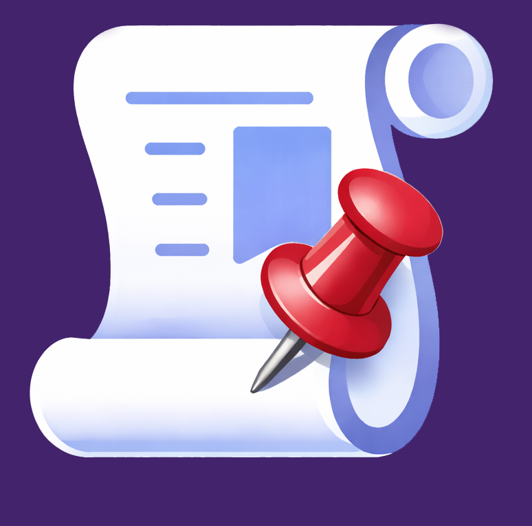

<p align="center">
  
</p>

<h1 align="center">📌 ScrollStamp Hybrid (V1 + V2)</h1>

<p align="center">
  <strong>Smart bookmarking for AI conversations and web content</strong>
</p>

<p align="center">
  <a href="#-features">Features</a> •
  <a href="#-supported-platforms">Platforms</a> •
  <a href="#-installation">Installation</a> •
  <a href="#-usage">Usage</a> •
  <a href="#-technical-details">Technical</a> •
  <a href="#-troubleshooting">Help</a>
</p>

<p align="center">
  
  
  
</p>

---

## 🎯 What is ScrollStamp?

**ScrollStamp** is a Chrome extension that intelligently bookmarks content based on context:

| Context                | Mode                 | How it Works                                  |
| ---------------------- | -------------------- | --------------------------------------------- |
| **AI Chat Platforms**  | 🤖 Message Mode (V2) | Bookmarks specific AI assistant responses     |
| **All Other Websites** | 📜 Scroll Mode (V1)  | Captures scroll position with context preview |

> **Note:** PDF documents are not supported as they are not standard web pages.

Never lose track of important AI responses or web content again!

---

## ✨ Features

### 🔥 Core Features

- **📌 One-Click Bookmarking** — Floating button appears on supported pages
- **💾 Persistent Storage** — Bookmarks saved across browser sessions
- **🎯 Precise Navigation** — Jump directly to bookmarked content
- **✏️ Editable Titles** — Rename bookmarks for easy identification
- **🎨 Visual Feedback** — Animated highlights when navigating
- **🔒 Robust Error Handling** — Graceful recovery from extension reloads

### 🤖 AI Chat Mode (Message-Based)

| Feature              | Description                                    |
| -------------------- | ---------------------------------------------- |
| Smart Detection      | Automatically identifies AI assistant messages |
| Message Preview      | Shows snippet of bookmarked content            |
| Platform-Specific    | Optimized selectors for each AI platform       |
| Conversation Context | Maintains accuracy even in long threads        |

### 📜 Scroll Mode (Position-Based)

| Feature                 | Description                      |
| ----------------------- | -------------------------------- |
| Position Tracking       | Saves exact scroll percentage    |
| Context Capture         | Extracts visible text as preview |
| Universal Compatibility | Works on any scrollable webpage  |

---

## 🌐 Supported Platforms

### AI Chat Platforms (Message Mode)

| Platform      | Domain                            | Status             |
| ------------- | --------------------------------- | ------------------ |
| ChatGPT       | `chat.openai.com` / `chatgpt.com` | ✅ Fully Supported |
| Claude        | `claude.ai`                       | ✅ Fully Supported |
| Google Gemini | `gemini.google.com`               | ✅ Fully Supported |
| Perplexity    | `perplexity.ai`                   | ✅ Fully Supported |
| Grok          | `grok.x.ai` / `x.com/i/grok`      | ✅ Fully Supported |
| DeepSeek      | `chat.deepseek.com`               | ✅ Fully Supported |

### Other Platforms (Scroll Mode)

| Platform      | Support              |
| ------------- | -------------------- |
| All Websites  | ✅ Universal Support |
| PDF Documents | ❌ Not Supported     |

---

## 📦 Installation

### From Source (Developer Mode)

1. **Download the Extension**

   ```bash
   # Clone the repository
   git clone https://github.com/YOUR_USERNAME/scrollstamp.git

   # Or download as ZIP and extract
   ```

2. **Open Chrome Extensions**
   - Navigate to `chrome://extensions/`
   - Or Menu → More Tools → Extensions

3. **Enable Developer Mode**
   - Toggle the switch in the top-right corner

4. **Load the Extension**
   - Click **"Load unpacked"**
   - Select the `scrollstamp` folder
   - The 📌 icon appears in your toolbar

5. **Pin the Extension** (Recommended)
   - Click the puzzle piece icon in Chrome toolbar
   - Click the pin icon next to ScrollStamp

---

## 🎮 Usage

### Creating a Bookmark

1. **Navigate** to any supported website or AI chat
2. **Scroll** to the content you want to bookmark
3. **Click** the floating 📌 button (bottom-right corner)
4. **Confirmation** toast appears when saved

### Viewing Bookmarks

1. **Click** the ScrollStamp icon in your browser toolbar
2. **Browse** your saved bookmarks with previews
3. **See** timestamps and platform indicators

### Navigating to a Bookmark

1. **Open** the extension popup
2. **Click** any bookmark entry
3. **Watch** as the page scrolls and highlights the content

> **Note:** If you're on a different page, ScrollStamp will navigate to the correct URL first, then scroll to your bookmark.

### Managing Bookmarks

| Action         | How To                                                            |
| -------------- | ----------------------------------------------------------------- |
| **Rename**     | Click the ✏️ pencil icon → Edit title → Press Enter or click away |
| **Delete One** | Click the 🗑️ trash icon on the bookmark                           |
| **Delete All** | Click "Clear All" in the popup footer                             |

### Keyboard Shortcuts

| Shortcut | Action             |
| -------- | ------------------ |
| `Enter`  | Confirm title edit |
| `Escape` | Cancel title edit  |

---

## 🔧 Technical Details

### File Structure

```
scrollstamp/
├── manifest.json      # Extension configuration & permissions
├── content.js         # Core bookmarking logic (injected into pages)
├── content.css        # Floating button & highlight styles
├── popup.html         # Extension popup structure
├── popup.js           # Popup interaction & bookmark management
├── popup.css          # Popup styling
├── icon.png           # Extension icon
└── README.md          # This file
```

### Storage Schema

**Message-Based Bookmark (AI Chats)**

```javascript
{
  id: "msg_1704067200000_3",      // Unique identifier
  type: "message",                 // Bookmark type
  url: "https://claude.ai/chat/...",
  storageKey: "claude.ai/chat/abc123",
  title: "Claude response about React",
  preview: "Here's how you can implement...",
  messageIndex: 3,                 // Position in conversation
  textSnippet: "Here's how you can...",
  platform: "claude",
  timestamp: 1704067200000
}
```

**Scroll-Based Bookmark (Other Sites)**

```javascript
{
  id: "scroll_1704067200000",     // Unique identifier
  type: "scroll",                  // Bookmark type
  url: "https://example.com/article",
  storageKey: "example.com/article",
  title: "Article Section",
  preview: "The content visible at...",
  scrollPercentage: 45.5,         // % down the page
  scrollY: 1250,                  // Pixel position
  timestamp: 1704067200000
}
```

### Permissions

| Permission  | Purpose                            |
| ----------- | ---------------------------------- |
| `storage`   | Save bookmarks locally             |
| `activeTab` | Access current tab for bookmarking |

### Browser Compatibility

| Browser        | Support                            |
| -------------- | ---------------------------------- |
| Google Chrome  | ✅ Full Support                    |
| Microsoft Edge | ✅ Full Support (Chromium)         |
| Brave          | ✅ Full Support                    |
| Opera          | ✅ Full Support                    |
| Firefox        | ⚠️ Requires manifest modifications |

---

## 🐛 Troubleshooting

### Common Issues

<details>
<summary><strong>Bookmark doesn't scroll to the right position</strong></summary>

This can happen if:

- saved bookmark working as a link and opening it on your current tab
- The page content has changed significantly since bookmarking
- The page uses dynamic/lazy loading
- You're on a different conversation/thread

**Solution:** For AI chats, try scrolling manually near the bookmark position. The extension will attempt multiple retries automatically.

</details>

<details>
<summary><strong>Floating button doesn't appear</strong></summary>

**Solutions:**

1. Refresh the page
2. ensure your cursor isnt on the website url when pressing a bookmark
3. Check if you're on a supported platform
4. Disable and re-enable the extension
5. Check for conflicts with other extensions
</details>

<details>
<summary><strong>"Extension context invalidated" error</strong></summary>

This occurs when the extension is updated or reloaded while a page is open.

**Solution:** Simply refresh the page. The extension handles this gracefully and will recover automatically.

</details>

<details>
<summary><strong>Bookmarks not persisting</strong></summary>

**Solutions:**

1. Check Chrome storage isn't full
2. Ensure you have permissions enabled
3. Try uninstalling and reinstalling the extension
</details>

---

## 🗺️ Roadmap

### v2.2.0 (Planned)

- [ ] Bookmark folders & categories
- [ ] Search within bookmarks
- [ ] Export/import bookmarks (JSON)
- [ ] Keyboard shortcut to create bookmark

### v2.3.0 (Planned)

- [ ] Sync bookmarks across devices
- [ ] Custom bookmark labels & tags
- [ ] Dark/light theme toggle
- [ ] Bookmark sharing via links

### v3.0.0 (Future)

- [ ] Firefox & Safari support
- [ ] AI-powered bookmark organization
- [ ] Integration with note-taking apps
- [ ] Browser sidebar view

---

## 📋 Version History

| Version    | Date | Highlights                                                                      |
| ---------- | ---- | ------------------------------------------------------------------------------- |
| **v2.1.0** | 2025 | Robust error handling, cross-page navigation, editable titles, hostname display |
| **v2.0.0** | 2024 | Message-based bookmarking for AI chats                                          |
| **v1.0.0** | 2024 | Initial release with scroll position bookmarking                                |

---

## 🤝 Contributing

Contributions are welcome! Here's how you can help:

1. **Fork** the repository
2. **Create** a feature branch (`git checkout -b feature/amazing-feature`)
3. **Commit** your changes (`git commit -m 'Add amazing feature'`)
4. **Push** to the branch (`git push origin feature/amazing-feature`)
5. **Open** a Pull Request

### Development Setup

```bash
# Clone your fork
git clone https://github.com/YOUR_USERNAME/scrollstamp.git

# Make changes to the code

# Load unpacked extension in Chrome for testing
# chrome://extensions/ → Load unpacked → Select folder
```

---

## ⭐ Support the Project

If ScrollStamp has been helpful to you, please consider:

<p align="center">
  <a href="https://github.com/YOUR_USERNAME/scrollstamp">
    
  </a>
</p>

**Your star helps:**

- 📈 Increase visibility for other users
- 💪 Motivate continued development
- 🌟 Show appreciation for the project

---

## 📄 License

This project is licensed under the **MIT License** — feel free to use, modify, and distribute.

```
MIT License

Copyright (c) 2024-2025 ScrollStamp Contributors

Permission is hereby granted, free of charge, to any person obtaining a copy
of this software and associated documentation files (the "Software"), to deal
in the Software without restriction, including without limitation the rights
to use, copy, modify, merge, publish, distribute, sublicense, and/or sell
copies of the Software.
```

---

## 📞 Support

Having issues? We're here to help!

| Channel             | Link                                                                           |
| ------------------- | ------------------------------------------------------------------------------ |
| 🐛 Bug Reports      | [Open an Issue](https://github.com/YOUR_USERNAME/scrollstamp/issues/new)       |
| 💡 Feature Requests | [Open an Issue](https://github.com/YOUR_USERNAME/scrollstamp/issues/new)       |
| 💬 Discussions      | [GitHub Discussions](https://github.com/YOUR_USERNAME/scrollstamp/discussions) |

---

<p align="center">
  <strong>Made with ❤️ by Sathwik Perla for the AI chat community</strong>
</p>

<p align="center">
  <sub>If you find ScrollStamp useful, don't forget to ⭐ star the repository!</sub>
</p>
